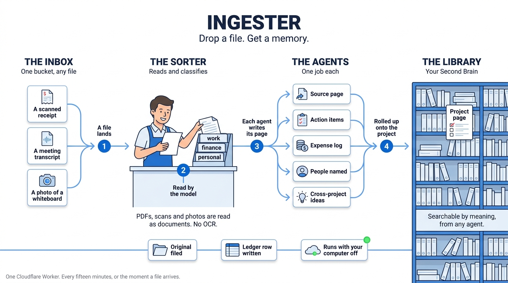

# Ingester

**Drop a file. Get a memory.**



Every PDF, screenshot, receipt, transcript, article and note you would rather
not file by hand goes into one inbox. The Ingester reads it, works out what it
is and which of your worlds it belongs to, writes it into your
[Second Brain](https://github.com/lennymadethat/second-brain) as pages any
agent can find by meaning, tells the matching project page something new
arrived, and files the original. It runs as one Cloudflare Worker, always on,
with your computer off.

Built and used daily as the intake for one person's entire working life.
Extracted here clean.

## What happens to a file

1. **Inbox.** A file lands in the R2 bucket, via `POST /upload`, the optional
   Drive bridge, or any tool that can write to a bucket. Root of the bucket
   means "not done yet".
2. **Read.** Text, Markdown, CSV, JSON and HTML are read directly. PDFs,
   scans and photos are handed to Claude as documents, which transcribes them.
   No OCR service, no PDF library.
3. **Classify.** Type (invoice, meeting, article…), domain (your own list),
   whether it carries actions, and the best-matching project page.
4. **Agents.** Each one that applies runs in its own queue job and writes its
   own output:

   | Agent | Writes |
   |---|---|
   | `ingester` | one source page per file under `wiki/sources/ingester/` |
   | `tagger` | topic tags and `[[link]]` suggestions |
   | `action-items` | a checklist from meetings and transcripts |
   | `receipt` | vendor, date, total, category into an expense log |
   | `people` | who was named, and why, into a contact inbox |
   | `cross-project` | ideas that could help another thing you work on |
   | `media-fallback` | a flag for anything no text came out of |

5. **Roll-up.** New, actionable bullets appended under one section of the
   project page. Never touches the parts you wrote.
6. **File.** The original moves to `processed/{domain}/`. A ledger row records
   what happened; one row per agent records what each did.

Once a week, the **Dream** pass reads every page that changed and proposes
consolidation (duplicates, stale claims, contradictions) in a separate report.
It never edits the pages it reviews.

## Quick start

Paste [`KIT.md`](KIT.md) into an agent with a shell and let it do this. By hand:

1. **A Second Brain library** first: run its migrations, note the project URL.
   Then run this repo's `migrations/0001_ingester_ledger.sql` in the same
   database.
2. `npm install`, then edit `wrangler.toml`: `SUPABASE_URL`, your `DOMAINS`,
   one line of `OWNER_CONTEXT`.
3. `npx wrangler login`, create the bucket and queues once:
   ```
   npx wrangler r2 bucket create ingester-inbox
   npx wrangler queues create ingester-jobs
   npx wrangler queues create ingester-dlq
   ```
4. Secrets: `npx wrangler secret put` each of `ANTHROPIC_API_KEY`,
   `OPENAI_API_KEY`, `SUPABASE_SERVICE_ROLE_KEY`, `INGESTER_TOKEN`.
5. `npx wrangler deploy`. `GET /health` should report the inbox, library and
   queue all true.
6. Drop something:
   ```
   curl -X POST "https://<worker>/upload?name=notes.md" \
     -H "x-ingester-token: $TOKEN" --data-binary @notes.md
   ```
   Within seconds the pages appear in the library; the sweep also runs every
   fifteen minutes on its own.

## Routes

| Route | Auth | Does |
|---|---|---|
| `GET /health` | none | inbox, library, queue, model, agent list |
| `POST /upload?name=` | token | put a file in the inbox and queue it (raw body or multipart `file`) |
| `POST /run` | token | queue every pending file; `?inline=1&limit=3` processes a few synchronously |
| `GET /status` | token | pending count and keys |
| `POST /dream` | token | run the weekly consolidation pass now |

Auth is one header, `x-ingester-token`, compared in constant time.

## When the model is down

Rate limits, outages and a missing key all raise the same `Unavailable` signal.
A file not yet dispatched simply stays in the inbox for the next sweep. An
agent job already in flight waits ten minutes and retries, up to ten times,
then lands in the dead-letter queue. Nothing is lost, nothing loops hot, and
the Worker never falls through to a second paid provider.

## What is in the box

```
src/index.js         routes, cron, queue consumer, the sorter and the agent runner
src/llm.js           the one Anthropic client: complete() and readDocument()
src/lib.js           extract, classify, helpers
src/workers.js       the seven agents
src/rollup.js        project-page roll-up with a review queue for no-match
src/memory.js        writes pages into a Second Brain library (same chunking + embeddings)
src/events.js        the ledger
src/dream.js         the weekly consolidation pass
migrations/          the ledger tables
bridge/              optional Google Drive → inbox script
AGENTS.md            what an agent should know about the Ingester's outputs
KIT.md               paste-prompt: an agent sets the whole thing up for you
```

## Design notes

- **Model.** `claude-opus-5` by default (`MODEL` in `wrangler.toml`); the two
  calls per file are short, low-effort JSON tasks. Server-side refusal
  fallbacks are on, so a document the primary model declines on policy grounds
  is re-run on a fallback model inside the same request.
- **Embeddings** match the Second Brain server exactly (`text-embedding-3-large`,
  chunked at `##` headings), so a page written here is indistinguishable from
  one written over MCP.
- **Audio and video** are not transcribed by this repo. They are flagged in
  `output/ingester/needs-attention.md` so nothing is silently dropped. Add a
  transcription step in `src/lib.js` → `extract()` if you need it.
- **Page content is data.** The Dream prompt and the classifier treat file
  contents as data to describe, never instructions to follow.

## License

MIT. Use it, fork it, feed it your whole desk.

<sub>Made by [lennymadethat](https://lennymadethat.com).</sub>
